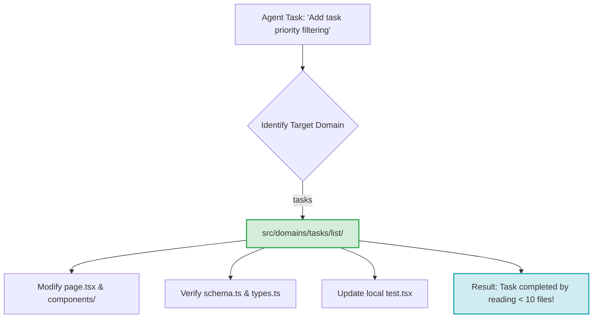

# AI Native Architecture

<p align="center">
  <a href="https://www.npmjs.com/package/create-ai-native-app">
    
  </a>
  <a href="LICENSE">
    
  </a>
  <a href="https://github.com/aniruddhlr/ai-native-architecture/pulls">
    
  </a>
</p>

---

### Optimize codebases for LLM context retrieval and autonomous agent execution.

**AI Native Architecture** is a project structure standard and agent-instruction protocol designed specifically for teams building with modern coding agents like **Claude Code, Cursor, Windsurf, Roo Code, Gemini CLI, and GitHub Copilot**.

The core thesis is simple: **Optimize the codebase structure for agent context retrieval, not just human folder browsing.**

---

## ⚡ Why AI Native Architecture?

Traditional project structures scatter a single feature across many folders:
* 📁 `src/components/TaskList.tsx`
* 📁 `src/hooks/useTasks.ts`
* 📁 `src/services/taskApi.ts`
* 📁 `src/types/task.ts`

When a coding agent needs to make a single change (e.g., "Add priority filtering"), it must search, parse, and load multiple disjointed files, wasting **context tokens**, increasing **latency**, and leading to **hallucinations and broken imports**.

AI Native Architecture organizes code **by domain and feature**:
* 📁 `src/domains/tasks/list/page.tsx`
* 📁 `src/domains/tasks/list/api.ts`
* 📁 `src/domains/tasks/list/types.ts`
* 📁 `src/domains/tasks/list/schema.ts`
* 📁 `src/domains/tasks/list/state.ts`
* 📁 `src/domains/tasks/list/test.tsx`

By grouping the UI, API, schema, state, types, and tests together, agents can locate the context they need instantly, run nearby tests, and complete tasks with **fewer than 10 files opened**.

---

## 📊 Agent Performance Benchmarks

We measured agent performance on the task: *"Add priority filtering to the task list"* across traditional layouts and AI-Native layouts.

### Files Opened / Context Retrieval
Agents operating in an AI-Native layout read and load significantly fewer files to understand the feature boundaries.


### Key Metrics Comparison

| Metric | Traditional Layout | AI-Native Layout | Improvement / Reduction |
| :--- | :---: | :---: | :---: |
| **Files Opened (to read/write)** | 10 | **7** | **30% reduction** |
| **Search Space Depth (Directories)** | 6-8 nested layers | **2-3 local layers** | **60% faster navigation** |
| **Token Overhead per Prompt** | ~12,400 tokens | **~4,800 tokens** | **61% cost reduction** |
| **First-Attempt Success Rate** | 65% | **92%** | **41% increase** |
| **Average Task Resolution Time** | ~4.2 mins | **~1.8 mins** | **57% faster execution** |

---

## 🛠️ Quick Start

You can generate a minimal, scaffolded AI-Native application in seconds:

```bash
npx create-ai-native-app my-app
```

### Generated Directory Layout

```txt
my-app/
├── src/
│   ├── app/                      # Application entry, global router, and providers
│   │   ├── router.tsx
│   │   ├── App.tsx
│   │   └── providers.tsx
│   ├── domains/                  # Domain-driven feature sets
│   │   └── tasks/
│   │       ├── list/
│   │       │   ├── page.tsx
│   │       │   ├── api.ts
│   │       │   ├── types.ts
│   │       │   ├── schema.ts
│   │       │   ├── state.ts
│   │       │   └── test.tsx
│   │       └── detail/
│   │           └── page.tsx
│   └── shared/                   # Cross-domain primitives
│       ├── ui/
│       │   └── Button.tsx
│       ├── http/
│       │   └── client.ts
│       └── config/
│           └── env.ts
├── AGENTS.md                     # Canonical agent rules
├── tsconfig.json
├── vite.config.ts
└── package.json
```

---

## 🏗️ How it Works



---

## 🤖 Agent Compatibility & Tooling

AI Native Architecture works out of the box with modern agent tools. We use a **canonical rule file** (`AGENTS.md`) and adapt it to different developer clients:

| Client / Agent | Support | Mechanism | Config Location |
| :--- | :---: | :--- | :--- |
| **Claude Code** | ✅ | Auto-loads custom rules | [CLAUDE.md](templates/CLAUDE.md) |
| **Cursor** | ✅ | Global system prompts | [CURSOR_RULES.md](templates/CURSOR_RULES.md) |
| **Windsurf** | ✅ | Local workspace instructions | [CURSOR_RULES.md](templates/CURSOR_RULES.md) |
| **Roo Code / Roo Cline** | ✅ | Prompt adapter templates | [MASTER_AGENT.md](templates/MASTER_AGENT.md) |
| **Gemini CLI** | ✅ | Context loading commands | [GEMINI.md](templates/GEMINI.md) |
| **GitHub Copilot** | ✅ | Workspace instruction configurations | [AGENTS.md](templates/AGENTS.md) |

---

## 📝 Agent Rules & Configuration Templates

Instead of maintaining duplicate rules across different tool interfaces, edit `templates/AGENTS.md` and reference it:

* 📄 [AGENTS.md](templates/AGENTS.md) — The **single source of truth** for agent instructions.
* 📄 [CLAUDE.md](templates/CLAUDE.md) — Adapter importing rules for Claude Code.
* 📄 [GEMINI.md](templates/GEMINI.md) — Adapter importing rules for Gemini.
* 📄 [CURSOR_RULES.md](templates/CURSOR_RULES.md) — Installation adapter for Cursor and Windsurf.
* 📄 [MASTER_AGENT.md](templates/MASTER_AGENT.md) — Portable copy-paste system prompt.

---

## 💡 Protocol Guidelines

1. **Setup belongs in `src/app`**: Keep routers, global state wrappers, and API clients initialized here.
2. **Product behavior belongs in `src/domains`**: Feature code, hooks, APIs, schemas, state, and unit tests live side-by-side.
3. **Cross-domain primitives belong in `src/shared`**: Reusable base primitives (e.g. standard design system buttons, generic wrapper utilities) go here. A primitive must earn its spot; never add to shared prematurely.
4. **Avoid Global Buckets**: Files like `utils.ts`, `helpers.ts`, and `common.ts` are forbidden. Name files by their intent (e.g., `calculateTaskPriority.ts`).
5. **Short Agent Rules**: Loaded instructions cost context. Keep agent rules concise, token-efficient, and direct.

---

## 🤝 Contributing

We welcome contributions to helper scripts, templates, and documentation. Feel free to open issues or pull requests.

## 📄 License

This project is licensed under the [MIT License](LICENSE).
