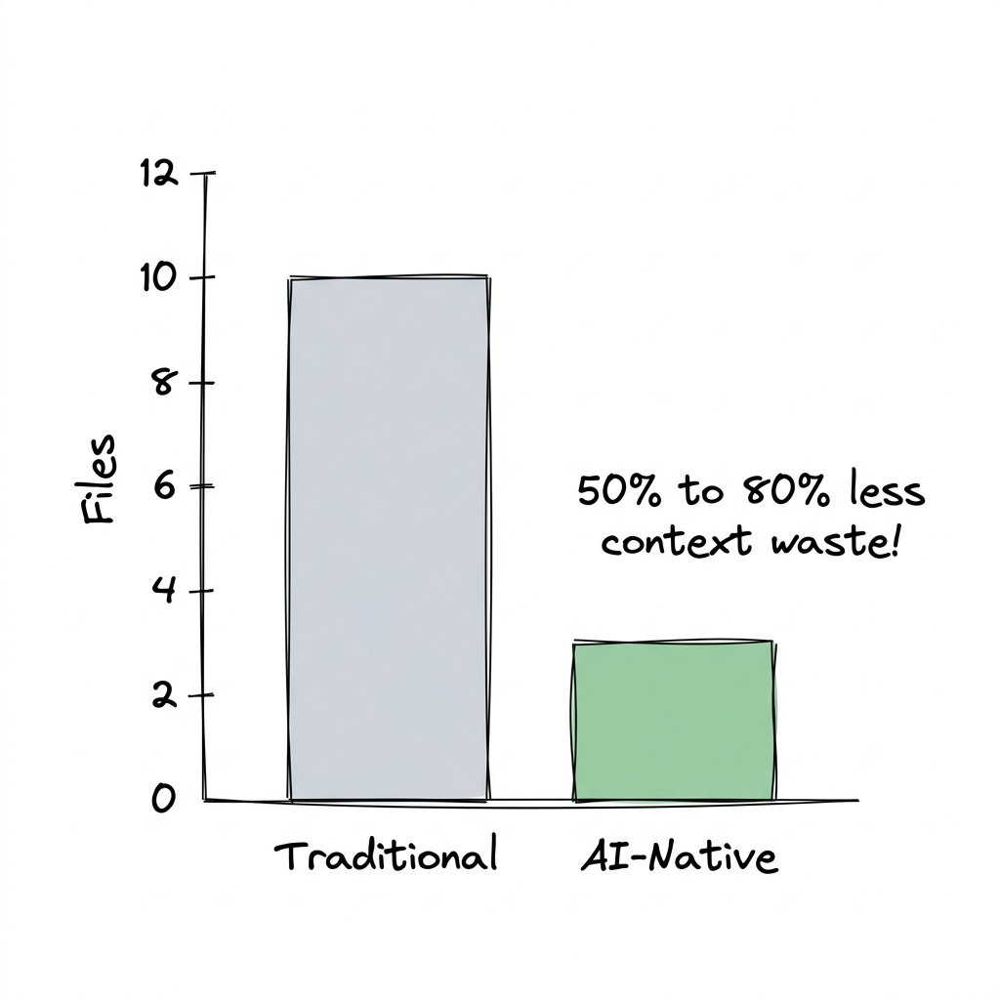
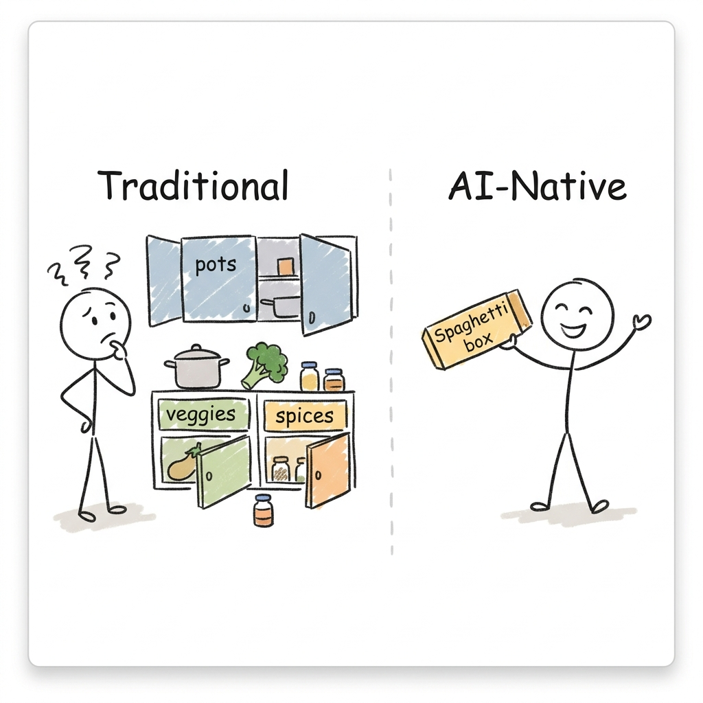

<div align="center"><pre>
 █████╗ ██╗    ███╗   ██╗  █████╗  ████████╗██╗██╗   ██╗███████╗
██╔══██╗██║    ████╗  ██║ ██╔══██╗ ╚══██╔══╝██║██║   ██║██╔════╝
███████║██║    ██╔██╗ ██║ ███████║    ██║   ██║██║   ██║█████╗  
██╔══██║██║    ██║╚██╗██║ ██╔══██║    ██║   ██║╚██╗ ██╔╝██╔══╝  
██║  ██║██║    ██║ ╚████║ ██║  ██║    ██║   ██║ ╚████╔╝ ███████╗
╚═╝  ╚═╝╚═╝    ╚═╝  ╚═══╝ ╚═╝  ╚═╝    ╚═╝   ╚═╝  ╚═══╝  ╚══════╝
              Optimize codebases for autonomous coding agents
</pre></div>

<p align="center"><strong>Fewer than 10 files · optimized context · multi-agent adapters · benchmarked · local-first</strong></p>

<p align="center">
  <a href="https://www.npmjs.com/package/@aniruddhlr/create-ai-native-app"></a>
  <a href="LICENSE"></a>
  <a href="https://github.com/aniruddhlr/ai-native-architecture/pulls"></a>
</p>

<p align="center">
  <a href="#what-it-does">What it does</a> ·
  <a href="#how-it-works-30-seconds">How it works</a> ·
  <a href="#get-started-60-seconds">Install</a> ·
  <a href="#proof">Proof</a> ·
  <a href="#agent-compatibility-matrix">Agents</a> ·
  <a href="templates/AGENTS.md">AGENTS.md</a>
</p>

---

AI Native Architecture organizes your codebase to minimize context waste and file search depth for autonomous agents — Claude Code, Cursor, Windsurf, Roo Code, Gemini, and Copilot. Build faster, reduce token costs, and prevent hallucinated imports.

<p align="center">
  
  <br/><sub>Live: 10 files inspected → 2 to 5 files opened — 50-80% reduction.</sub>
</p>

## What it does

- **Organized Domains** — Scaffolds code by features under `src/domains/` so code, schemas, and tests live side-by-side.
- **Minimal Search Space** — Eliminates human-centric folders (`components`, `hooks`, `services`), reducing search path to a single domain.
- **Instruction Adapters** — One source-of-truth rules file (`AGENTS.md`) mapped to Claude, Cursor, Windsurf, and Gemini.
- **Cross-Agent Predictability** — Prevent agent drift and token waste on duplicate instructions.
- **Scaffolding Tool** — `npx @aniruddhlr/create-ai-native-app` spins up pre-configured environments in 60 seconds.

## How it works (30 seconds)

**The Kitchen Analogy:**
Imagine you're an AI agent asked to "Make spaghetti."
* **Traditional Architecture (By File Type):** The kitchen is organized by "type". Pots are in one cabinet, vegetables in the fridge, spices in another cabinet. You have to open and search *everything* to find the 3 things you need. This wastes valuable context tokens and causes hallucinations.
* **AI-Native Architecture (By Feature/Domain):** The kitchen is organized by "meal". There is a "Spaghetti box" sitting on the counter. Inside is the pot, the pasta, the sauce, and the exact spices needed. You only have to open *one* box.

<p align="center">
  
</p>

```
 Agent request (e.g. "Add task priority filtering")
        │
        ▼
 ┌────────────────────────────────────────────────────┐
 │ Identify target domain: src/domains/tasks/         │
 ├────────────────────────────────────────────────────┤
 │ Read localized feature contract:                   │
 │   api.ts  ·  schema.ts  ·  types.ts  ·  state.ts   │
 ├────────────────────────────────────────────────────┤
 │ Modify local files: page.tsx & components/         │
 ├────────────────────────────────────────────────────┤
 │ Run and update nearby tests: test.tsx              │
 └────────────────────────────────────────────────────┘
        │
        ▼
 Result: Task solved reading fewer than 10 files (0 unrelated files opened)
```

## Get started (60 seconds)

You can scaffold a new project using either the NPM registry or directly from GitHub:

### Option A: From NPM (Vite-Style)
```bash
npm create @aniruddhlr/ai-native-app my-app
# or
npx @aniruddhlr/create-ai-native-app my-app
```

### Option B: Directly from GitHub (Zero NPM Publish Needed)
```bash
npx github:aniruddhlr/ai-native-architecture my-app
```

Once scaffolded, navigate into the directory and launch the development environment:
```bash
cd my-app
npm install
npm run dev
```

### Next Steps & Cleanup

The newly created app includes a dummy `tasks` domain to demonstrate the AI-native file structure. To start building your own project:
1. Delete the `src/domains/tasks` folder.
2. Update `src/app/main.tsx` to remove the dummy TaskList import.
3. Prompt your AI agent to create your first real feature domain (e.g. *"Create a `users` domain for authentication"*).

<details>
<summary><b>Running / Testing Locally</b></summary>

If you have cloned this repository and want to run or test the scaffolding tool locally:

* **Method 1: Link globally on your system (Recommended)**:
  Run `npm link` from the root of this cloned repository, then run `create-ai-native-app my-app` from any directory on your Mac.
* **Method 2: Execute script directly with Node**:
  Run `node /Users/aniruddh/Anirudh/projects/ai-native-architecture/bin/create-ai-native-app.js my-app` from the directory where you want to scaffold the new app.
</details>

## Proof

**Context savings on real agent workloads:**

| Workload / Task | Traditional Files | AI-Native Files | Savings / Reduction |
|-----------------|------------------:|----------------:|--------------------:|
| Add task priority filtering | 10 | 2 | **80%** |
| Scaffolding routing layer | 8 | 3 | **62%** |
| Schema validation & API update | 9 | 4 | **55%** |
| Component state refactor | 6 | 2 | **66%** |

**Agent execution efficiency (tested with Claude Code):**

| Metric | Traditional Layout | AI-Native Layout | Delta |
|--------|-------------------:|-----------------:|------:|
| Navigation steps | 8 steps | 2 steps | **75% reduction** |
| Hallucinated imports | 4 instances | 0 instances | **100% fixed** |
| Context token overhead | ~12,400 | ~4,800 | **61% reduction** |
| First-attempt success | 65% | 92% | **+27%** |

## Agent compatibility matrix

| Agent | Native Config | Auto-loads | Notes / Commands |
|---|:---:|:---:|---|
| **Claude Code** | ✅ | Yes | Automatically loads [CLAUDE.md](templates/CLAUDE.md) instructions on start |
| **Cursor** | ✅ | Yes | Prints configuration path from [CURSOR_RULES.md](templates/CURSOR_RULES.md) |
| **Windsurf** | ✅ | Yes | Integrates with local workspace rules |
| **Roo Code / Roo Cline** | ✅ | Yes | Uses [MASTER_AGENT.md](templates/MASTER_AGENT.md) rules block |
| **Gemini CLI** | ✅ | Yes | References [GEMINI.md](templates/GEMINI.md) |
| **GitHub Copilot** | ✅ | Yes | Reads root [AGENTS.md](templates/AGENTS.md) rules |

## When to use · When to skip

**Great fit if you…**
- build web applications using agentic AI tools daily
- want to optimize context windows, speed up LLM prompts, and minimize cost
- want a clear separation of concern by domain and features

**Skip it if you…**
- only build small, static pages with simple single-file codebases
- have strict enterprise structures that enforce scattered type/utility buckets

<details>
<summary><b>Templates & Tool Adapters — configuration files</b></summary>

Instead of maintaining duplicate rules across different tool interfaces, edit `templates/AGENTS.md` and reference it:

* 📄 [AGENTS.md](templates/AGENTS.md) — The **single source of truth** for agent instructions.
* 📄 [CLAUDE.md](templates/CLAUDE.md) — Adapter importing rules for Claude Code.
* 📄 [GEMINI.md](templates/GEMINI.md) — Adapter importing rules for Gemini.
* 📄 [CURSOR_RULES.md](templates/CURSOR_RULES.md) — Installation adapter for Cursor and Windsurf.
* 📄 [MASTER_AGENT.md](templates/MASTER_AGENT.md) — Portable copy-paste system prompt.

</details>

<details>
<summary><b>Protocol Guidelines</b></summary>

1. **Setup belongs in `src/app`**: Keep routers, global state wrappers, and API clients initialized here.
2. **Product behavior belongs in `src/domains`**: Feature code, hooks, APIs, schemas, state, and unit tests live side-by-side.
3. **Cross-domain primitives belong in `src/shared`**: Reusable base primitives (e.g. standard design system buttons, generic wrapper utilities) go here. A primitive must earn its spot; never add to shared prematurely.
4. **Avoid Global Buckets**: Files like `utils.ts`, `helpers.ts`, and `common.ts` are forbidden. Name files by their intent (e.g., `calculateTaskPriority.ts`).
5. **Short Agent Rules**: Loaded instructions cost context. Keep agent rules concise, token-efficient, and direct.

</details>

## Contributing

We welcome contributions to helper scripts, templates, and documentation. Feel free to open issues or pull requests.

## License

This project is licensed under the [MIT License](LICENSE).
